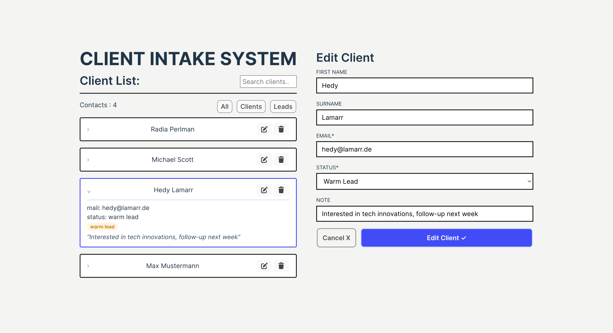
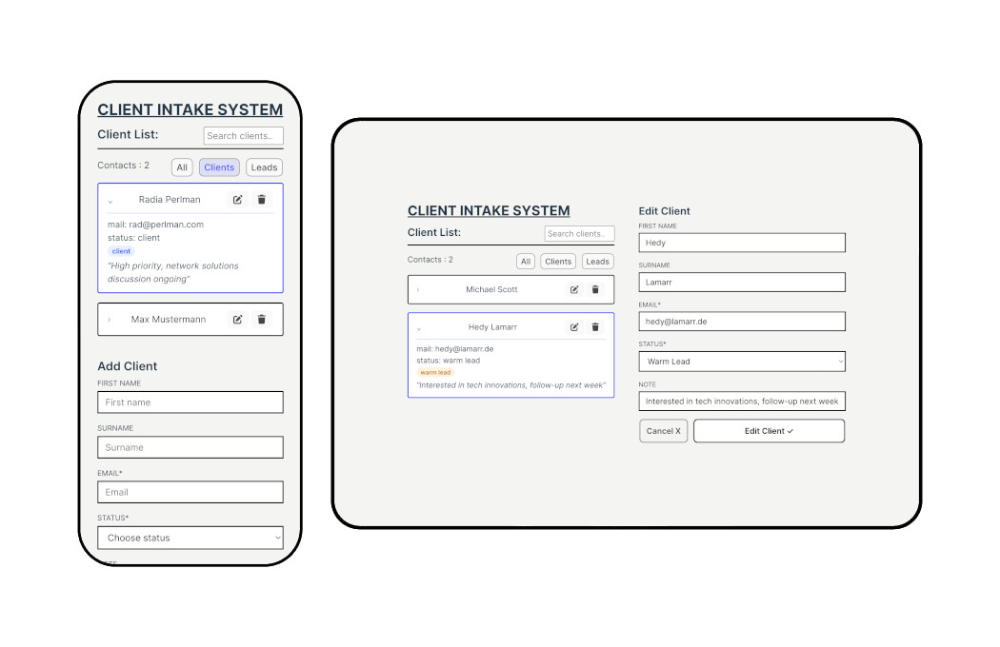

# Client Intake System – Frontend

React frontend for authentication and client management with protected routes.

## Features
- Authentication flow (register, login, guest login, logout)
- Temporary guest accounts
- Session-based auth with cookie support (credentials included in API calls)
- Protected dashboard route & navigation via React Router
- Display clients
- Add / Edit / Delete clients
- Optimistic UI updates
- Search & filter clients
- Responsive design

## Tech Stack
- React
- JavaScript (ES6+)
- React Router DOM
- FontAwesome
- CSS

## Environment Variables
Create a `.env` file:

```env
VITE_API_URL=https://your-backend-url/api
```

Example:

```env
VITE_API_URL=http://localhost:8080/api
```

## Installation
```bash
npm install
```

## Run Locally
```bash
npm run dev
```

## Build
```bash
npm run build
```

## Lint
```bash
npm run lint
```

## Usage
- Frontend runs on http://localhost:5173 (Vite default)
- Backend must be running and configured with CORS + credentials support
- Auth check runs on app load via `GET /auth/me`
- Dashboard is available only for authenticated users
- Guest login is available from the landing page

## Screenshots
<p align="center">


</p>

## Notes
- Requires Node.js version `>=20.19.0 || >=22.12.0`

## Future Improvements

- Pagination for large client lists

- Unit tests

- UI animations / feedback improvements
